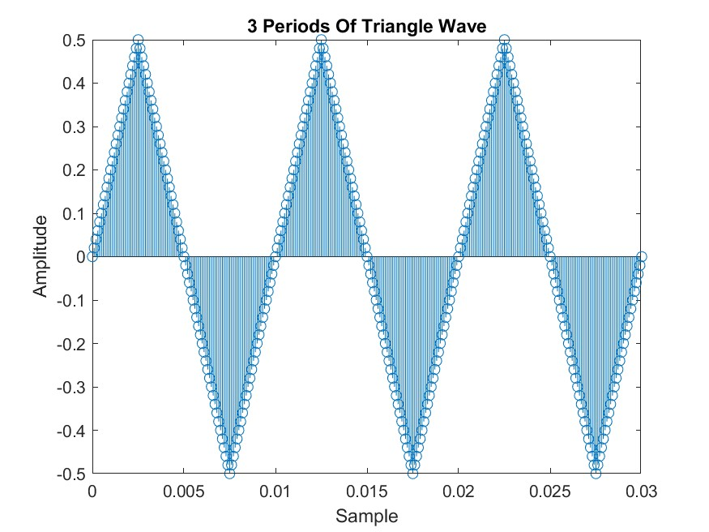
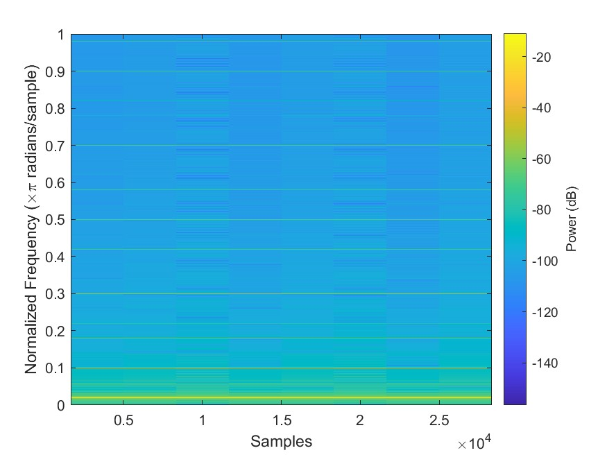
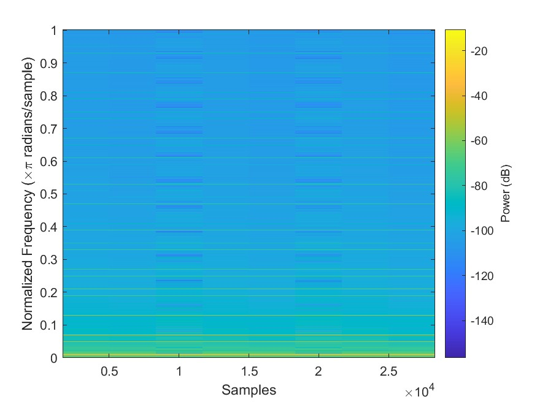
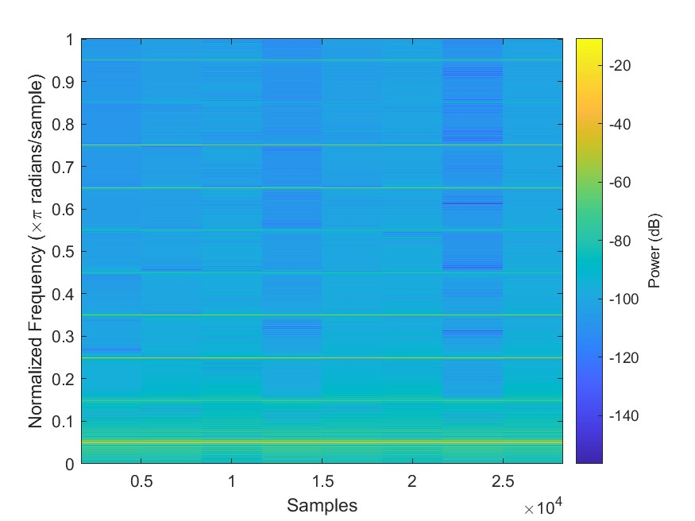

# Lab S-8

- Noah Mecham
- Brock Brown

## Pre-Lab

### Objective

Further study the spectral content of the signals analyzed via the _spectrogram_; this will involve the following steps:

1. Synthesize a linear-FM chirp and display its spectrogram with chirp parameters that will deomonstrate aliasing.
2. Synthesize a periodic triangle wave and relate the harmonic line spectrum to the wave's fundamental period using the spectrogram.
3. Compare spectrograms using both logarithmic and linear amplitude.
4. Examine details of the harmonic lines in the logarithmic spectrogram of the triangle wave.
5. _Spectrogram:_ make a spectrogram of voice signal and relate the harmonic line spectrum to previous measurement of pitch period.

### Chirp, or Linearly-Swept Frequency

A linear-FM _chirp_ is a sinusoid whose instantaneous frequency changes linearly from a starting value to an ending one. Instantaneous frequency can be determined by the derivative of the input to its sinusoidal function, for example, the instantaneous frequency of the sinusoidal function $\sin(2\pi f_0t + \varphi)$ is $\frac d{1\pi dt}(2\pi f_0t + \varphi) = f_0$, which is constant. However, if we want the following linearly-increasing instantaneous frequency:
$$f_{instantaneous} = \mu t + f_0$$
then we need to integrate, multiply by $2\pi$, and use it as an argument to our sinusoidal function:
$$2\pi\int f_{instantaneous} = 2\pi\int \mu t + f_0 = 2\pi(\frac12\mu t^t + f_0t) + \varphi = \pi\mu t^2 + 2\pi f_0t + \varphi$$
$\therefore$ the sinusoidal function for a linear-FM chirp signal is:
$$\sin(\pi\mu t^2 + 2\pi f_0t + \varphi)$$
where $\mu = \frac{f_{final} - f_0}{t_{final} - t_0}$.

### Matlab Synthesis of Chirp Signals

We used the following variables to call the [hyperlinked Matlab function `[t,x] = generateChirp(f,t,fs)`](https://github.com/brownbr61/wretched-absolution/blob/master/s-8/generateChirp.m) to generate and plot the following linear-FM chirp:

``` m
f = [0 5];
t = [0 5];
fs = 150;
[t,x] = generateChirp(f,t,fs);
plotspec( x, 1/fs), colorbar, grid on %-- with negative frequencie
```


## Matlab Synthesis of Triangle Wave

We used the following variables to call the [hyperlinked Matlab function `[t,x] = generateTriangle(f,t,fs)`](https://github.com/brownbr61/wretched-absolution/blob/master/s-8/generateTriangle.m) to generate and plot the following triangle wave:

``` m
f = 5;
t = [0 1];
fs = 1000;
[t,x] = generateTriangle(f,t,fs);
plotspec( x, 1/fs), colorbar, grid on %-- with negative frequencie
```


### Decibels

Decibels (dB) is the engineering standard for logarithmic scales, which is defined as $20\log_{10}(A)$ where $A = amplitude$. This can be graphed using the built-in Matlab `spectrogram`; this viewing scale makes two notable changes in interpretation:

1. _Ratios Become Differences:_ An input ratio of $\frac PQ$ will become:
$$ 20\log_{10}\frac PQ = 20\log_{10}P - 20\log_{10} Q $$
2. _Viewable Range must be limited:_ Because $\log0 = -\infty$, minimum dB level must be defined. For example, if a linear amplitude range were $range = [0,1]$, a dB range of 100 would set the viewable dB range to $[-100, 0]$, which viewed linearly would be: $[10^{-100/20},10^{0/20}] = [10^{-5},10^{0}] = [0.00001,1]$.

To get a feel for the $linear:logarithmic$ relationship, the following values will be expressed linearly, then in dB, respectively:

- $0.1 = 20\log_{10} 0.1 = -20 dB$
- $1 = 20\log_{10} = 0 dB$
- $2 = 20\log_{10} 2 = 6.02 dB$
- $5 = 20\log_{10} 0.1 = 13.9 dB$
- $10 = 20\log_{10} 10 = 20 dB$
- $100 = 20\log_{10} 100 = 40 dB$

In addition, the following values will be translated from dB to linear values:

- $-6 dB = \frac12$
- $-60dB = 0.001$
- $-80dB = 0.0001$

### Fourier Series of a Triangle Wave

The zero-mean triangle wave with amplitude $Amp = 0.5$ has the following known Fourier Series:
$$ a_k = \{^{\frac{-2}{\pi^2k^2},k = odd}_{0, k=even} $$
The coefficients for $k = [1,3,5\dotsm,13,15]$ are as follows (as output by matlab):

```sh
index: 1.0000    2.0000    3.0000    4.0000    5.0000    6.0000    7.0000    8.0000
coeff: -0.2026   -0.0225   -0.0081   -0.0041   -0.0025   -0.0017   -0.0012   -0.0009
```

The ratios $k_n:k_1$ are as follows:

```sh
index: 1.0000    2.0000    3.0000    4.0000    5.0000    6.0000    7.0000    8.0000
ratio: 1.0000    0.1111    0.0400    0.0204    0.0123    0.0083    0.0059    0.0044
```

The above data are plotted in the following image:


## Lab Exercise

### 2.1

### 2.2.1

#### a
The below script will generate a triangle wave and return discrete samples of that wave, giving the ability to fine tune parameters such as a the period, amplitude, signal length, and finally the sample frequency.

``` m
function y = triangle(fs,amp,T,tstop)
 %fs - Sample rate
 %amp - Amplitude of wave
 %T - Period of wave
 %tstop - Duration of signal
 x = 0:(1/fs):tstop;

 % Formula for a triangle wave
 y=((4*amp)/T)*(abs(mod(x-(.25*T),T)-0.5*T))-amp;
end
```

#### b
Using the script created in step a we generate a triangle wave with the following parameters:  

fs = 10000 Hz \
T = 10 ms \
Duration = 3 s  



#### c & d

Using matlab's built in spectrogram function we are able to plot our triangle created in the previous step and view the power at each frequency.




From the image, we can see that harmonic frequencies occur at the following normalized frequencies:

.02 = 100 Hz\
.06 = 300 Hz\
.1 = 500 Hz \
.14 = 700 Hz \
.18 = 900 Hz \
.22 = 1100 Hz \
.26 = 1300 Hz \
.30 = 1500 Hz \
.34 = 1700 Hz \
.38 = 1900 Hz \
.42 = 2100 Hz \
.46 = 2300 Hz \
.50 = 2500 Hz \
.54 = 2700 Hz \
.58 = 2900 Hz \
.62 = 3100 Hz \
.66 = 3300 Hz \
.70 = 3500 Hz \
.74 = 3700 Hz \
.78 = 3900 Hz \
.82 = 4100 Hz \
.86 = 4300 Hz \
.90 = 4500 Hz \
.94 = 4700 Hz \
.98 = 4900 Hz

#### e
From the above plot we are able to see that the normalized fundamental frequency is .02 or 100 Hz. The fundamental frequency found from the plot matches with the frequncy set for the wave originally.

#### f
Since our plot comes in dB we need to convert out of the dB scale. The amplitude of the 1st & 3rd harmonics are:  
1st - .29  
3rd - .34x10^-4  

With the ratio being 8529.4.

### 2.2.2
#### a
The dB scale is given by the formula x=20log(A)  
  
From this forumla it can be seen that an increase of 6dB will result in an change in x2 in the amplitude.  

#### b
Using the below equation we can see determine the difference between a1 & a3

```m
20*log10(((-2)/(pi^2*1^2))/((-2)/(pi^2*3^2)))
```

```sh
19.0849 dB
```

#### c
Using the below equatio nwe can see the difference between a1 & a15

```m
20*log10(((-2)/(pi^2*1^2))/((-2)/(pi^2*15^2)))
```

```sh
47.0437 dB
```

### 2.2.3

#### a
The spectrogram plot given in 2.2.1.c lists is given in dB and shows all the frequencies. A list of frequencies can be seen below.

.02 = 100 Hz\
.06 = 300 Hz\
.1 = 500 Hz \
.14 = 700 Hz \
.18 = 900 Hz \
.22 = 1100 Hz \
.26 = 1300 Hz \
.30 = 1500 Hz \
.34 = 1700 Hz \
.38 = 1900 Hz \
.42 = 2100 Hz \
.46 = 2300 Hz \
.50 = 2500 Hz \
.54 = 2700 Hz \
.58 = 2900 Hz \
.62 = 3100 Hz \
.66 = 3300 Hz \
.70 = 3500 Hz \
.74 = 3700 Hz \
.78 = 3900 Hz \
.82 = 4100 Hz \
.86 = 4300 Hz \
.90 = 4500 Hz \
.94 = 4700 Hz \
.98 = 4900 Hz

#### b
A new triangle wave is generated with the following parameters:  

fs = 10000 Hz \
T = 20 ms \
Duration = 3 s  

The spectrogram plot can be seen below:  

  

From the plot we can see that there are a total of 50 harmonic lines. With the highest frequency occuring at 4950 Hz and the fundamental frequency at 50 Hz.

#### c
The amplitudes of the 1st and 3rd harmonic amplitudes are as follows:

1st: -10.86 dB
3rd: -68.77 dB

These match up with the magnitudes measured in step 2.2.1.f.

#### d  
A new triangle wave was generated with the following parameters:  

fs = 10000 Hz \
T = 20 ms \
Duration = 3 s  

The spectrogram plot can be seen below:

  

As mentioned in the lab, this spectrogram shows a larger spacing between harmonic lines, even though it has a shorter period.